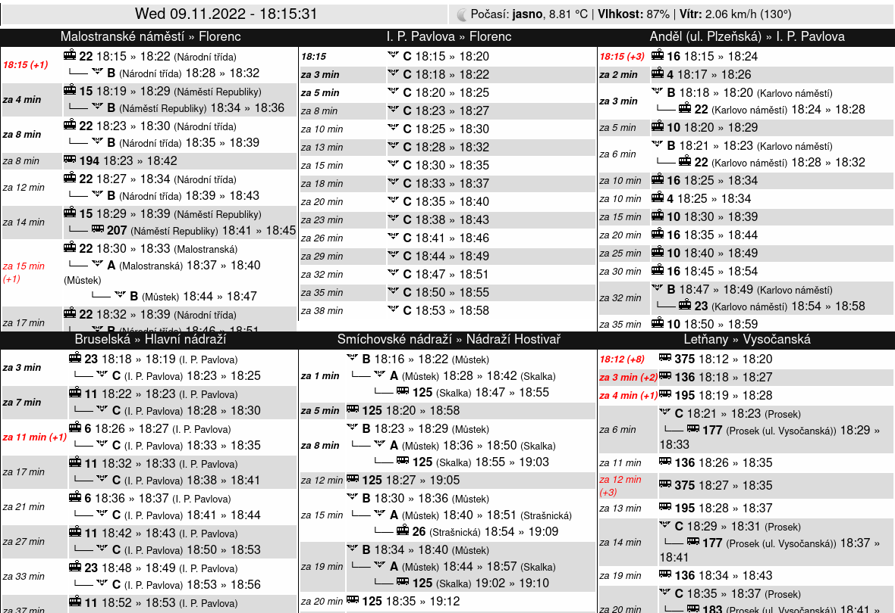

# idos-dashboard
## What
Simple web app showing your favourite public transport departures.

I've made this specifically to have departures on a Kindle e-ink display, hence the black and white scheme of it, 
as visible on this screenshot:




## How
The API uses is the CRWS API, more info can be found here: https://crws.docs.apiary.io/

Unfortunately, since 2019 the CRWS API is no longer free for trial inside the Prague transit system, 
so you will need a valid `userID` from the API's owners to use this. 

This app uses my [idospy](https://github.com/chinese-soup/idospy) WIP wrapper as a submodule. 

The backend uses `Flask` and simple HTML template with `jinja2` as the templating system.

For the current weather, it uses the [OpenWeatherMap API](https://openweathermap.org/api).

## Requirements
* Flask, jinja2
* [idospy](https://github.com/chinese-soup/idospy)

## Usage
1. Start from the example configuration file:
```bash
$ cp config.example.py config.py
```
2. Edit the config file to suit your favourite connections and add a valid userID to the `Configuration` class of `config.py`
3. Run the app
   * using your favourite WSGI-capable HTTP server.
   * alternatively, use the `python3 app.py` to run it using the development server